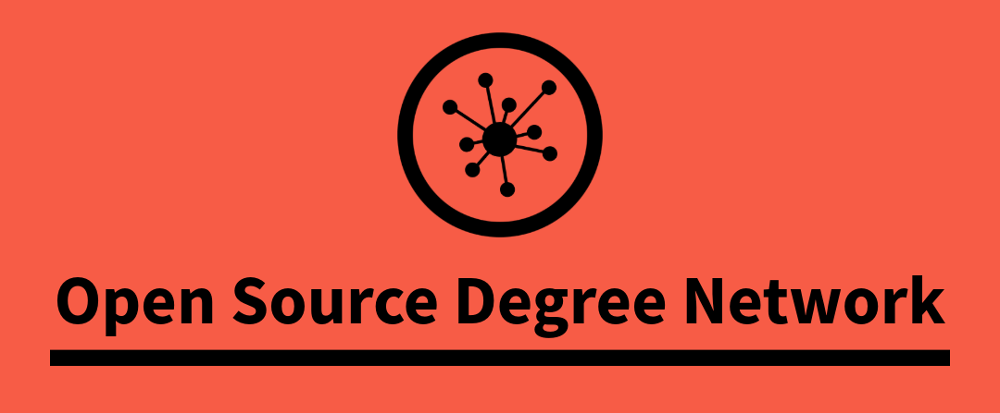

## Summary

This organisation provides repositories containing resources for all levels of knowledge. The purpose of these repositories is to offer the materials needed to support various degrees and educational systems. Our data is based on the legal frameworks of the countries we model, creating an open-source network of reliable and accurate knowledge. We continuously review the legislation that defines academic degrees, scientific progress, course durations, and curricular content to ensure our resources reflect current educational standards. The objective is not to create a new university, but a network of all degrees and educational systems.

[https://github.com/osd-network](https://github.com/osd-network)

